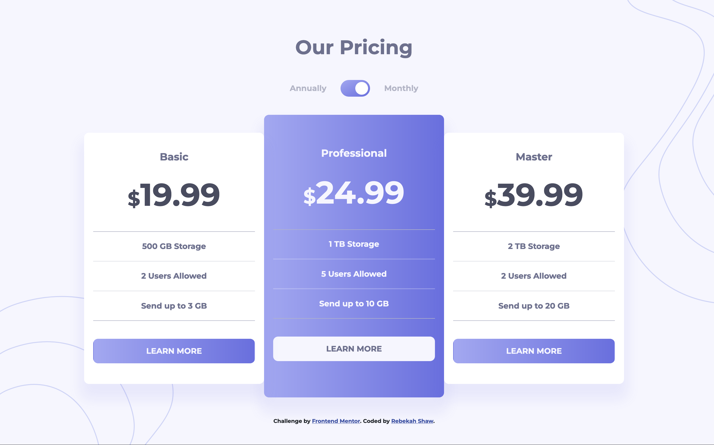

# Frontend Mentor - Pricing component with toggle solution

This is a solution to the [Pricing component with toggle challenge on Frontend Mentor](https://www.frontendmentor.io/challenges/pricing-component-with-toggle-8vPwRMIC). Frontend Mentor challenges help you improve your coding skills by building realistic projects. 

## Table of contents

- [Overview](#overview)
  - [The challenge](#the-challenge)
  - [Screenshot](#screenshot)
  - [Links](#links)
- [My process](#my-process)
  - [Built with](#built-with)
  - [What I learned](#what-i-learned)
  - [Continued development](#continued-development)
  - [Useful resources](#useful-resources)
- [Author](#author)

## Overview

### The challenge

Users should be able to:

- View the optimal layout for the component depending on their device's screen size
- Control the toggle with both their mouse/trackpad and their keyboard
- **Bonus**: Complete the challenge with just HTML and CSS

### Screenshot

#### Desktop

#### Mobile

### Links

- Solution URL: [ Solution](https://github.com/rebekahshaw92//pricing-component-with-toggle)
- Live Site URL: [Live Site](https://rebekahshaw92.github.io//pricing-component-with-toggle)

### Built with

- Semantic HTML5 markup
- CSS custom properties
- Sass
- JavaScript
- Bootstrap 5
- Mobile-first workflow

### What I Learned

Though doing this project I was able to continue working with Bootstrap 5 cards and row/columes. I also learned how to create a toggle and have information change when the toggle is clicked.

### Continued Development

I would like to continued working both with JavaScript and Bootstrap 5.

### Userful Resources 

- [Bootstrap](https://getbootstrap.com) - This site helped me learn all I needed to know about Bootstrap.

## Author

- Website - [Rebekah Shaw](https://www.rebekahshaw.com)
- Frontend Mentor - [@rebekahshaw92](https://www.frontendmentor.io/profile/rebekahshaw92)
- Twitter - [@x_beckyboo_x](https://www.twitter.com/x_beckyboo_x)